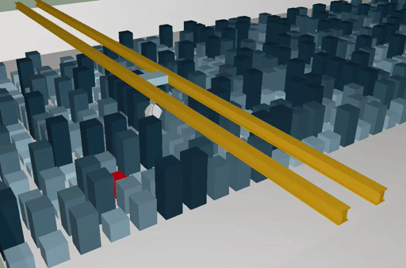

# Three js tests 

- Three.js tests
- [Storage](https://ossi1801.github.io/ThreeJs-Test/)

## Features
- Cube storage with animated moving crane
- Cubes height indicated with color gradiant
- Some other 3d stuff i guess

## Requirements

Three.js npm or clone this repo and use prebuilt npm packages

> Tested with firefox & chrome

